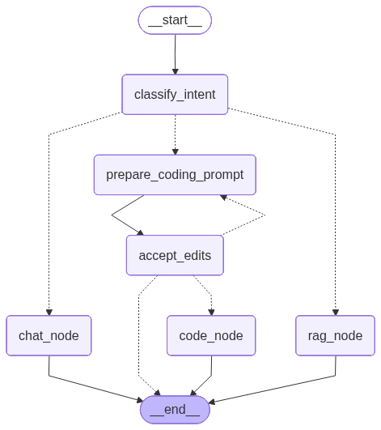

# LangGraph Crash Course

A multi-agent chatbot built with LangGraph, following the [crash course of NeuralNine](https://www.youtube.com/watch?v=uWLJAtMOVT0) on YouTube.

The project uses OpenRouter as the LLM provider so you can plug in any model without managing separate API keys for each provider.

## What This Project Does

The agent classifies every user message into one of three intents and routes it to a specialized agent:

- **Chat** - casual conversation, greetings, general questions
- **Knowledge (RAG)** - questions answered from a small gaming knowledge base using vector similarity search
- **Code** - coding requests that get handed off to Claude Code with a human approval step

The code path includes a human-in-the-loop approval loop: the system rewrites your request into a clear prompt, shows it to you, and waits for you to approve, reject, or revise it before executing anything.

## Project Structure

```
main.py       - Simple single-node chatbot with memory (the basics)
agent.py      - Full multi-agent routing workflow (the main project)
workspace/    - Sandboxed directory where the code agent operates
    README.md - a small README to have something to be edited by the code agent
    animation.py - a small Python script to be edited by the code agent, it contains simple & cool cli animations
        (hint: use it with uv run python workspace/animation.py [wave | starfield | retro])
graph.png     - Auto-generated visualization of the agent graph (regenerated on each run of agent.py)
```

### main.py

The starting point. A single LLM node connected to START and END, with an in-memory checkpointer for conversation persistence. Sends a message, then asks "what is my name?" to prove the memory works. This is the "hello world" of LangGraph.

### agent.py

The full workflow. Here is what happens when you send a message:

1. Your message enters the graph and hits the **classifier node**, which uses structured output (Pydantic) to tag your intent as `chat`, `rag`, or `code`.

2. A **routing function** reads that tag and sends the message down the right path.

3. If it is a **chat** message, a conversational LLM responds directly.

4. If it is a **knowledge** question, the RAG node converts your question into an embedding, searches a small in-memory vector store of gaming facts, pulls the top 3 matches, and feeds them as context to the LLM.

5. If it is a **code** request, the message goes through three stages:
   - **Prompt preparation** - the LLM rewrites your message into a standalone instruction using conversation context
   - **Approval gate** - the graph pauses (using LangGraph's `interrupt` system) and asks you to approve, reject, or revise
   - **Execution** - if approved, Claude Code runs the instruction inside the `workspace/` directory via subprocess

## Setup

### Prerequisites

- Python 3.13+
- [uv](https://docs.astral.sh/uv/) package manager
- An [OpenRouter](https://openrouter.ai/) API key
- [Claude Code](https://docs.anthropic.com/en/docs/claude-code) CLI installed (only needed for the code agent path)
- Alternatively, you can use [Opencode](https://opencode.ai/download) also you just need to change the line where it calls Claude Code in `agent.py` to call Opencode instead.

### Installation

```bash
git clone https://github.com/UfukTanriverdi8/langgraph-crash-course.git
cd langgraph-crash-course

uv sync
```

Create a `.env` file in the project root:

```
OPENROUTER_API_KEY=your-key-here
```

### Running

The simple chatbot:

```bash
uv run main.py
```

The full multi-agent workflow:

```bash
uv run agent.py
```

Type your messages and see the intent classification in brackets. For code requests, you will be prompted to approve before anything runs. Type `quit`, `exit`, or `q` to stop.

## Graph Visualization



## Credits

Built by following the [NeuralNine LangGraph crash course](https://www.youtube.com/watch?v=uWLJAtMOVT0). Adapted to use OpenRouter instead of direct OpenAI calls.
